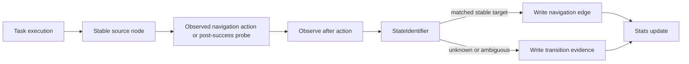

# Skill Graph Navigation Transition Design

## Purpose

The skill graph currently learns forward task paths well, such as:

```text
1 -> 2 -> 3 -> 4
```

It does not yet learn the reverse or reset transitions that users naturally expect after reaching a deeper page. Examples include `4 -> 3` via `back`, `3 -> 2` via `back`, or `2 -> 1` via tapping a visible `首页` tab instead of pressing `back`.

This design adds low-risk navigation transition capture. The first version only records these transitions and their evidence. It does not use them in default forward skill compilation.

## Goals

- Capture stable return/reset relationships discovered during real GUI runs.
- Keep the canonical forward skill graph as a DAG for prefix and goal path compilation.
- Avoid disrupting the user task just to build graph data.
- Record enough evidence to later promote navigation edges into recovery/path planning safely.
- Avoid LLM decisions for navigation identity, target selection, and graph merge.

## Non-Goals

- Do not actively crawl the app or explore every possible navigation control.
- Do not use navigation edges in default `compile()` or `compile_deepest_prefix()` in the first version.
- Do not add a general cyclic graph planner yet.
- Do not infer `back` targets from text descriptions alone.
- Do not treat same-screen actions as meaningful navigation edges.

## Edge Model

Keep existing forward edges as the only edges used by normal skill path compilation:

```text
kind = "action"
```

Add navigation edge kinds:

```text
kind = "navigation_back"
kind = "navigation_reset"
kind = "navigation_home"
kind = "navigation_unknown"
```

### `navigation_back`

Represents a verified transition caused by a `back` action.

Example:

```text
Order page --back--> Mall page
```

Only write a concrete target when state identification after `back` matches a stable active state node.

### `navigation_reset`

Represents a verified transition caused by tapping a stable UI selector that resets the navigation position, such as `首页`, `主页`, a bottom-tab home button, or another stable root control.

Example:

```text
Profile page --tap 首页--> Home page
```

The edge action must be selector-grounded. Abstract labels such as `go home` are not enough.

### `navigation_home`

Represents a verified transition caused by a platform `home` action. It normally exits the app and should not be used for app-internal pathing unless the target is explicitly identified as launcher/home.

### `navigation_unknown`

Represents a navigation action whose source is stable but whose target could not be resolved to a stable node. It is evidence for future refresh/recovery, not a path edge.

For storage compatibility, if `GraphEdge.target_node_id` cannot be null, store unresolved navigation events in a lightweight transition evidence queue instead of forcing a fake target node into the canonical graph.

## Capture Rules

A navigation transition may be recorded as a concrete edge only when all conditions hold:

- source node is `kind=state`, `status=active`;
- source node has a canonical selector-grounded `state_contract`;
- action is one of `back`, `home`, or a selector-grounded tap/reset control;
- observation after action can be matched through `StateIdentifier`;
- target node is `kind=state`, `status=active`;
- target node has a canonical selector-grounded `state_contract`;
- source and target are different nodes;
- the edge is scoped to the same platform and app unless the action intentionally exits the app.

If any condition fails, record evidence only. Do not create a canonical navigation edge.

## Runtime Behavior

Default graph execution remains unchanged:

```text
State Identification -> Goal Resolution -> PathCompiler over action edges
```

Navigation edges are excluded from:

- `PathCompiler.compile()`;
- `PathCompiler.compile_k_shortest()`;
- `PathCompiler.compile_deepest_prefix()`;
- stable prefix ranking;
- graph-only readiness checks for forward path coverage.

They may be used later by recovery logic, but that is out of scope for the first implementation.

## Low-Cost Probe Strategy

The first version uses conservative probes:

1. During normal graph/agent execution, record observed action transitions when the action itself is `back`, `home`, or a selector-grounded reset tap.
2. After a task succeeds, if the terminal node is stable and the runtime can restore the terminal page after probing, run at most one `back` probe.
3. After the probe, observe the screen and run state identification.
4. If target identification succeeds, write `navigation_back`.
5. If target identification fails, enqueue transition evidence with reason `navigation_target_unknown`.

Do not run multi-step return probing in the first version. For example, if a task reaches node `4`, probe only `4 -> ?`, not `4 -> 3 -> 2 -> 1`.

## Post-Probe Restore

Navigation capture must not leave the user on the wrong final page.

Before running an active post-success probe, the runtime must know how to restore the terminal state. The accepted V1 restore strategy is:

1. Remember the terminal node and the exact forward path used to reach it.
2. Execute one navigation probe, such as `back`.
3. Identify the resulting state.
4. If the resulting state is on the remembered forward path, compile the suffix from that state back to the terminal node using only normal `kind="action"` edges.
5. Execute that suffix and verify the terminal contract.

If restore planning is unavailable, skip the active probe and record `probe_skipped` evidence. If restore execution fails, record `restore_failed`, save the navigation evidence, and return the final GUI task result with an explicit note that the screen was not restored.

This keeps navigation learning from silently changing the user's expected end state.

## Reset Candidate Detection

Reset controls are candidates, not automatic edges, until verified by execution.

Candidate controls come from UI evidence:

- `ui_tree`;
- `clickable_text`;
- `content_desc`;
- `resource_ids`;
- stable controls inside `retrieval_profile`.

Initial allowlist:

```text
首页
主页
Home
home
Main
```

The allowlist is only a candidate filter. A candidate becomes `navigation_reset` only after execution and target state identification succeeds.

## Persistence

Concrete navigation edges use the existing graph store:

- `GraphEdge.kind` stores the navigation kind;
- `action_type` stores the executed action, such as `back`, `home`, or `tap`;
- `target` stores the visible selector label or command name;
- `precondition` stores the source node contract;
- `stats` records attempts, successes, latency, and failure reasons.

Unresolved navigation evidence should be persisted outside canonical forward pathing. The preferred first version is a JSONL queue beside the existing refresh queue:

```text
skill_graph_transition_evidence.jsonl
```

Each record contains:

```json
{
  "timestamp": 0,
  "platform": "android",
  "app": "com.example",
  "source_node_id": "node-a",
  "action_type": "back",
  "edge_kind": "navigation_back",
  "target_node_id": null,
  "reason": "navigation_target_unknown",
  "candidate_node_ids": []
}
```

## Safety Controls

- Probe budget: at most one post-success back probe per GUI task.
- No probe while the task is still incomplete.
- No active probe unless terminal restore is planned first.
- No probe after high-risk or intervention-required actions.
- No probe if the backend observation is stale or failed.
- No probe if the terminal node is auxiliary or noncanonical.
- No fake target nodes for unresolved navigation.
- No LLM-based target resolution.

## Data Flow



## Future Use

After enough evidence accumulates, navigation edges can become recovery tools:

- if the agent is deeper than the target path, try a verified `navigation_back`;
- if the target is under the app root, try a verified `navigation_reset`;
- if a navigation edge has low success rate, ignore it and fall back to normal agent behavior.

This future use requires a separate plan because it changes runtime path selection.

## Success Criteria

- Forward graph compilation remains DAG-like and ignores navigation edges by default.
- A successful task can record at most one verified back transition from the terminal node when terminal restore is available.
- Verified back/reset transitions persist with stats and source preconditions.
- Unknown navigation results are recorded as evidence without creating fake canonical nodes.
- Active probes do not silently leave the user away from the requested terminal page.
- Existing graph tests continue to pass.
- A trace can show when a navigation transition was probed, matched, skipped, or recorded as unknown.

## Open Decisions Locked For V1

- Navigation edges are capture-only in V1.
- Only one post-success back probe is allowed per task.
- Reset controls are candidate-only until execution proves the target.
- The canonical forward graph remains separate from navigation/recovery edges.
